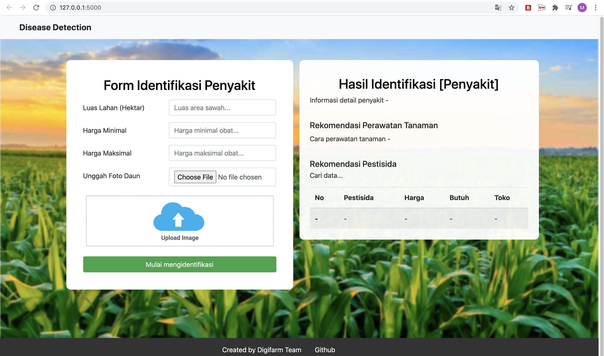

# Disease Identification

Disease Identification is end-to-end image classification project that allow user to identify a disease in a plant leaf by giving the leaf image to the system. The System will identify the disease using ResNet50 model where the model accuracy reaches 86.12% (we do model training for maize and rice leaves). After the system get the disease, the result will be used to perform a query select on the data to get treatment and pesticide recommendations for the plant. For pesticide recommendation, farmer can select and compare with pesticide is easier to get at a lower price. We hope that this project can help Indonesian farmers in caring for crops. <b><i>This is just MVP product</i></b>, feel free to develop for feature improvement.

**Project Overview**

 

### Let's Get Started
If you want to try this project to your local system, just follow this step :
<ol>
  <li>saya zakaria suka makan nasi nasi dan lauk</li>
  <li>saya pesan nasi dan tahu</li>
  <li>tahu buat makan</li>
</ol>
